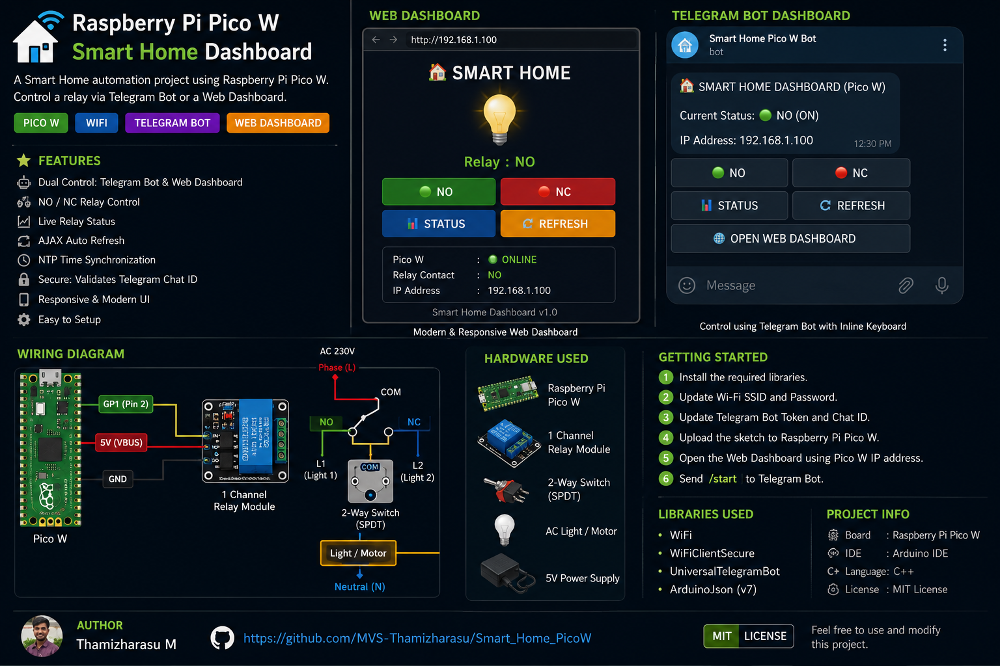
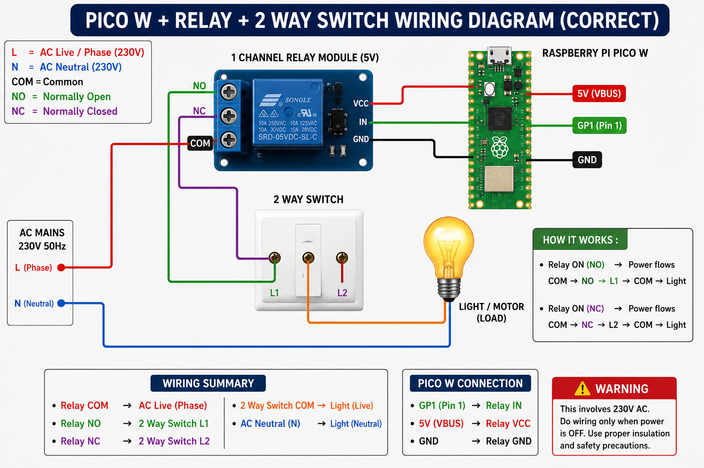

# 🏠 Raspberry Pi Pico W Smart Home Dashboard



A Smart Home automation project built using the **Raspberry Pi Pico W**. This project allows you to control a relay through both a **Telegram Bot** and a **Local Web Dashboard**.

---

## ✨ Features

- 🌐 Modern Dark Web Dashboard
- 🤖 Telegram Bot with Inline Keyboard
- 🟢 NO / 🔴 NC Relay Control
- 📊 Live Relay Status
- 🔄 AJAX Auto Refresh
- 📡 Wi-Fi Connectivity
- ⏰ NTP Time Synchronization
- 🔒 Telegram Chat ID Authentication
- 📱 Mobile Friendly Interface

---

## 📸 Project Images

### 🌐 Web Dashboard


### 🤖 Telegram Bot Dashboard


### 🔌 Wiring Diagram



---

## 🛠 Hardware Used

- Raspberry Pi Pico W
- 1-Channel Relay Module
- 2-Way Switch (SPDT)
- AC Light / Motor
- 5V Power Supply

---

## 🔌 Hardware Connections

### Raspberry Pi Pico W → Relay Module

| Raspberry Pi Pico W | Relay Module |
|---------------------|--------------|
| GP1                 | IN           |
| VBUS (5V)           | VCC          |
| GND                 | GND          |

---

### AC Wiring

```text
              AC 230V

Phase (L)
    │
    ▼
Relay COM
 ┌─────┴─────┐
 │           │
NO          NC
 │           │
L1          L2
   2-Way Switch
        │
       COM
        │
   Light / Motor
        │
 Neutral (N)
```

---

## 🤖 Telegram Dashboard

```
┌──────────────┬──────────────┐
│ 🟢 NO        │ 🔴 NC        │
├──────────────┼──────────────┤
│ 📊 STATUS    │ 🔄 REFRESH   │
├──────────────┴──────────────┤
│ 🌐 OPEN WEB DASHBOARD       │
└─────────────────────────────┘
```

---

## 🌐 Web Dashboard

Features available on the Web Dashboard:

- 🟢 NO Button
- 🔴 NC Button
- 📊 Live Relay Status
- 🔄 Refresh Button
- 🌐 Responsive Dark UI
- 📱 Mobile Friendly Interface

---

## 📚 Libraries Used

| Library | Description |
|---------|-------------|
| WiFi | Built-in Wi-Fi Library |
| WiFiClientSecure | HTTPS Client |
| UniversalTelegramBot | Telegram Bot API |
| ArduinoJson v7 | JSON Processing |
| time.h | NTP Time Synchronization |

---

## 🖥️ Board Package

Install the following board package using **Arduino IDE → Boards Manager**:

- **Raspberry Pi Pico/RP2040 Boards**
- **Author:** Earle F. Philhower III

---

## 🚀 Getting Started

1. Install the required board package.
2. Install all required libraries.
3. Update your Wi-Fi SSID and Password.
4. Update your Telegram Bot Token.
5. Update your Telegram Chat ID.
6. Connect the relay module to GP1.
7. Upload the sketch to the Raspberry Pi Pico W.
8. Open the Web Dashboard using the Pico W IP Address.
9. Send `/start` to the Telegram Bot.

---

## 📂 Project Structure

```
Smart_Home_PicoW
│
├── Smart_Home_PicoW.ino
├── README.md
├── LICENSE
└── images
    ├── smart_home_dashboard_overview.png
    ├── Web Dashboard.png
    ├── Telegram Bot Dashboard.png
    └── pico-w-relay-2-way-switch-wiring.png
```

---

## 🚀 Future Improvements

- OTA Firmware Update
- MQTT Support
- Home Assistant Integration
- Multiple Relay Support
- Sensor Monitoring
- Energy Monitoring
- Mobile App Support

---

## 📄 License

This project is licensed under the **MIT License**.

See the [LICENSE](LICENSE) file for more details.

---

## 👨‍💻 Author

**Thamizharasu M**

- GitHub: https://github.com/MVS-Thamizharasu
- Project: https://github.com/MVS-Thamizharasu/Smart_Home_PicoW

---

⭐ If you found this project useful, please consider giving it a **Star** on GitHub!
